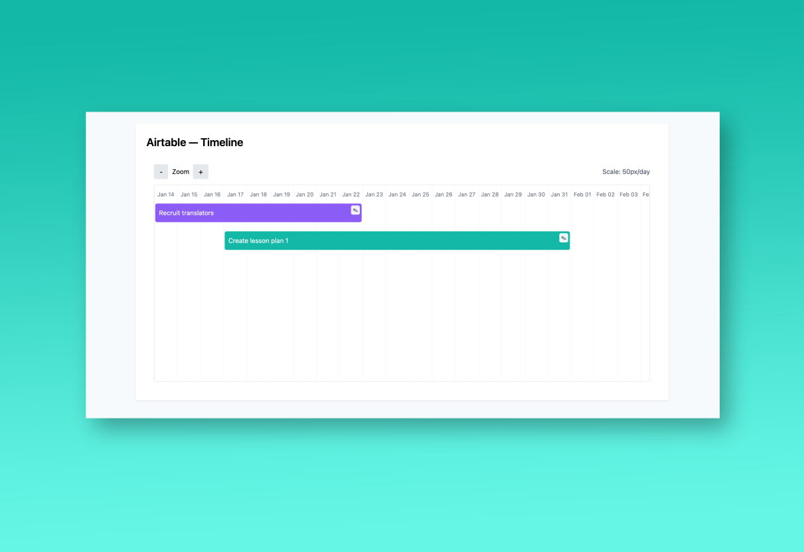

# 📅 Airtable Timeline

## About the Project

**Timeline Visualization** is a React project that implements a compact and efficient timeline component to visualize items distributed across horizontal lanes.

This timeline arranges items in lanes so that events that do not overlap can share the same lane, maximizing the use of space. The component supports zooming in and out and allows inline editing of item names, providing a user-friendly and interactive experience.

Designed to be clean, simple, and responsive, this project delivers a good balance between functionality and usability within a short implementation timeframe.

### Desktop View



---

## Features

- 📊 **Compact Lane Assignment** – Items are organized so they share lanes whenever possible, avoiding unnecessary gaps.
- 🔍 **Zoom In and Out** – Users can zoom the timeline view to see more or less detail.
- ✏️ **Inline Editing** – Edit the name of each timeline item directly on the interface.
- 🎨 **Responsive and Clean UI** – Focus on usability and simplicity.

---

## Technologies Used

- **React 18**
- **Parcel**
- **Tailwind CSS**
- **PostCSS**
- **Autoprefixer**
- **date-fns**

---

## Design Decisions

- I researched several timeline UI examples on Google and Pinterest.
- Opted for a minimalist and clean design to prioritize clarity and usability.
- Focused on functionality first, given the 4-hour time constraint.
- Chose inline editing for convenience and better user interaction.
- Zooming was implemented to enhance navigation through potentially dense timelines.

---

## What I liked about my implementation

- Simplicity and ease of use.
- Clean and readable code that’s maintainable.
- The timeline effectively maximizes horizontal space by lane sharing.
- The application is performant

---

## What I would change if I were to do it again

- Invest more time in UI/UX design, using Figma or similar tools for a more polished look.
- Use Typescript for a better development experience
- Add drag-and-drop support to adjust event dates interactively.
- Implement unit and integration tests for better coverage.

---

## How I would test this if I had more time

- Write unit tests for all components using Jest and React Testing Library.
- Cover edge cases such as overlapping events, very short/long event names, and zoom limits.
- Add integration tests for user interactions like zooming and inline editing.
- Perform accessibility testing to ensure keyboard navigation and screen reader compatibility.

---

## Installation:

To run the project locally, follow the steps below:

### 1. Prerequisites

Before running this project locally, make sure you have the following installed:

- **Node.js** (v18 or later) — [Download here](https://nodejs.org/)
- **npm** (comes with Node.js) or **yarn**
- A modern code editor like [Visual Studio Code](https://code.visualstudio.com/)

You can verify your versions by running:

```bash
node -v
npm -v
```


### 2. Clone the repository

```bash
git clone https://github.com/leandrofc/timeline-assignment.git
```

### 3. Access the project directory:

```sh
cd timeline-assignment
```

### 4. Install dependencies

```bash
npm install
```

### 5. Start the development server

```bash
npm run start
```